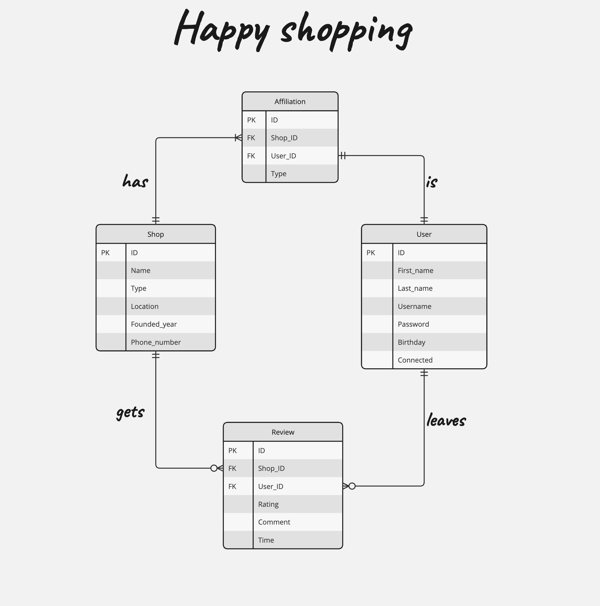

# Design Document

By Wai Yan Kyaw

Video overview: <https://youtu.be/g7XIfHBc2Vs>

## Scope

The database for shops in the area and users (or customers) includes all necessary entities to facilitate the process of listing shops around the area, leaving reviews by users and the relationship between the shops and users, for instance if they are owners or employees. So the scope includes:

* Shops, including basic identifying information
* Users, including basic identifying information
* Affiliations, including the relationship between the shops and users
* Reviews, including the time when users leave reviews and comments

Out of scope are elements like connections between users.

## Functional Requirements

Within the database,

* CRUD operations for shops and users
* Tracking all the ratings and comments left by the users for the shops
* Knowing the relationships between the shops and the users, such as owners or employees

However, with this iteration, we do not include the connections between the users, such as they are friends.

## Representation

Entities are captured in SQLite tables with the following schema.

### Entities

The database includes the following entities:

#### Shops

The `Shops` table includes:

* `id`, which specifies the unique ID for the shops as an `INTEGER`. This column thus has the `PRIMARY KEY` constraint applied.
* `name`, which specifies the name of the shops as an `TEXT`, given `TEXT` is appropriate for the name field.
* `type`, which specifies what type of business the shop does as an `TEXT`, given `TEXT` is appropriate for such a field.
* `location`, which specifies the location of the shop as an `TEXT`, for the same reason as `type` field.
* `founded_year`, which specifies the founded year of the shop as an `NUMERIC`, given `NUMERIC` is appropriate for such field.
* `phone_number`, which specifies the phone number of the shop as an `NUMERIC` type affinity, as this is more appropriate than `TEXT` or `INTEGER` field.

All columns in the `Shops` table are required and thus have `NOT NULL` constraint applied. The `founded_year` column also has the `CHECK` constraint to ensure that users do not type accidentally less than `1900`. No other constraints are necessary.

#### Users

The `Users` table includes:

* `id`, which specifies the unique ID for the users as an `INTEGER`. This column thus has the `PRIMARY KEY` constraint applied.
* `first_name`, which specifies the first name of the users as an `TEXT`, given `TEXT` is appropriate for the name field.
* `last_name`, which specifies the last name of the users as an `TEXT`, for the same reason as `first_name`.
* `username`, which specifies the username of the users as an `TEXT`, for the same reason as `first_name` and `last_name`. The `username` column as the `UNIQUE` constraint applied to ensure that there is no duplication of usernames in the table.
* `password`, which specifies the password of the users as an `TEXT`. This should be hashed and stored.
* `birthday`, which specifies the birthday of the users as an `NUMERIC` type affinity. This handles well such day formats (2000-01-01, for instance).
* `connected`, which specifies the time when the user connects to the application. This has the default current timestamp applied to it, if no other information is provided for the column.

All column in the `Users` table are required and thus have `NOT NULL` constraint applied. No other constraints are necessary.

#### Affiliations

The `Affiliation` table includes:

* `id`, which specifies the unique ID for the affiliations as an `INTEGER`. This column thus has the `PRIMARY KEY` constraint applied.
* `shop_id`, which represents the ID of the shop that the user will affiliate with, as an `INTEGER`. This column thus has the `FOREIGN KEY` constraint applied, referencing the `id` column from the `shops` table to ensure data integrity.
* `user_id`, which is the ID of the user that the shop will affiliate with, as an `INTEGER`. This column thus has the `FOREIGN KEY` constraint applied, referencing the `id` column from the `users` table to ensure data integrity.
* `type`, which specifies the affiliation type between shops and users as an `TEXT`. This column has the `CHECK` constraint applied with two values `Owner` and `Employee`.

All columns in the `Affiliations` table are required and thus have `NOT NULL` constraint applied. No futher constraints are necessary.

#### Reviews

The `Reviews` table includes:

* `id`, which specifies the unique ID for the review made by users for shops as an `INTEGER`. This column thus has the `PRIMARY KEY` constraint applied.
* `shop_id`, which is the ID of the shops that users leave reviews for shops as an `INTEGER`. This column thus has the `FOREIGN KEY` constraint applied, referencing the `id` column from the `shops` table to ensure data integrity.
* `user_id`, which is the ID of the users that leave reviews for shops as an `INTEGER`. This column thus has the `FOREIGN KEY` constraint applied, referencing the `id` column from the `users` table to ensure data integrity.
* `rating`, which specifies the rating that users give to shops as an `INTEGER`. This column has `CHECK` constraint applied to ensure that the rating limits at 5.
* `comment`, which specifies the comment that users give to shops as an `TEXT`, given `TEXT` is the appropriate type for such a field.
* `time`, which specifies the time that users leave the rating and comment as an `NUMERIC`, given that `NUMERIC` handles such input better. The column also has the `DEFAULT` constraint applied with current timestamp if not provided any input.

All columns except `comment` in the `Reviews` table are required and thus have `NOT NULL` constraint applied. No further constraints are necessary.

### Relationships

As detailed by the diagram:

* One user is capable of writing 0 to many reviews. 0, if they don't leave any reviews and many, if they leave many reviews for many different shops. A review is made by one and only user.
* One shop is capable of receiving 0 to many reviews. 0, if they don't get any users leaving reviews for them and many, if the shop attracts many users. A review is made by one and only user for each shop.
* One user can be affiliated with just one shop with a specific designation. Each affiliation is made with one and only user.
* One shop can have at least 1 to many affiliations. 1, if they only have 1 affiliation, such as an owner, and many, if there are employees for the shop. Each affiliation is made with one and only shop.

## Optimizations

Per the queries as shown in the `queries.sql`, it is common for users to search for the average reviews of shops, as well as the names (last and first) of the owner of the shops that were founded, let's say, after 2020. For that reason, indexes are created on the `user_id`, `shop_id` and `rating` from `reviews` and `type` from `affiliation` tables to speed up the identification of the shops and users by those columns.

## Limitations

The current schema assumes the reviews given by each user and not the connections between each user, for instance whether they go to the shops together and leave the ratings on a given day, that this schema cannot show. This would require another table that connects users, shops and the connection between them on a one-to-many relationship.
